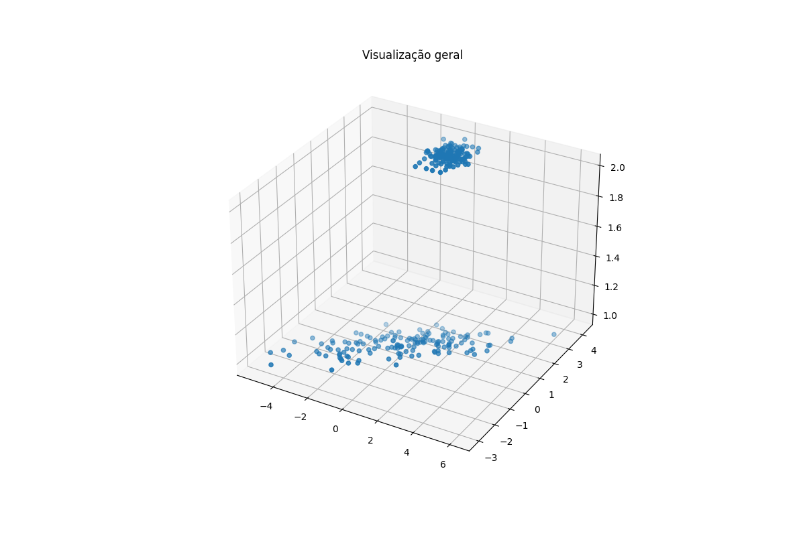
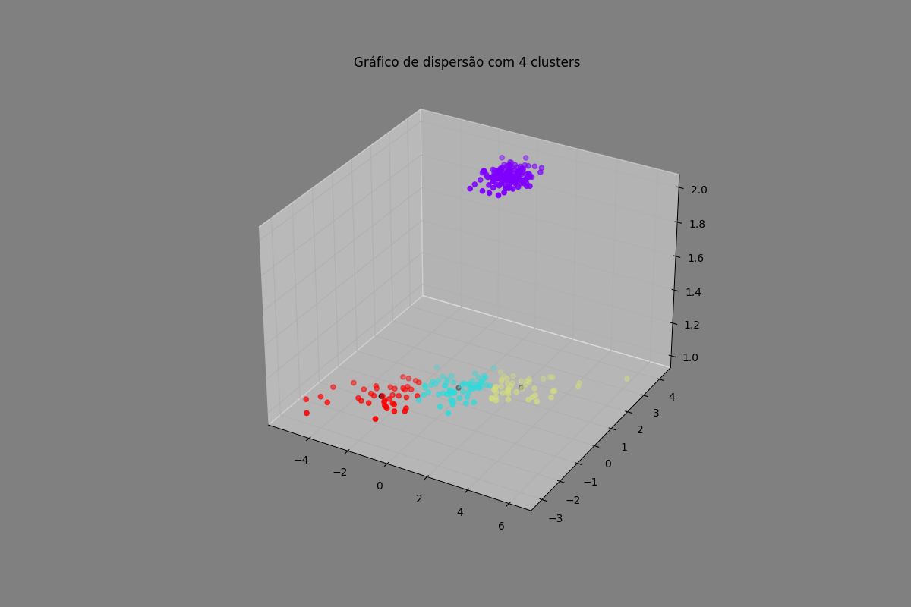
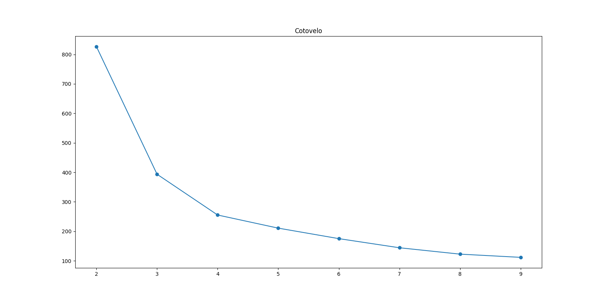

# Relatório de K-means - IA

# **1. Breve descrição da técnica**

O K-means é um algoritmo usado para agrupar informações em K grupos diferentes. Ele busca encontrar K pontos centrais que minimizem a soma das distâncias entre cada informação e o seu ponto central correspondente. O algoritmo funciona em duas etapas: primeiro, ele associa cada informação ao seu ponto central mais próximo; depois, ele atualiza os pontos centrais calculando a média das informações associadas a cada grupo. O processo se repete até que os pontos centrais não mudem mais ou até que o número máximo de tentativas seja alcançado.

# **2. Breve descrição do código**

O código fornecido realiza um processo de clustering utilizando o algoritmo K-means. Vamos explicar o que cada parte do código faz:

Importação de bibliotecas:

```python
from sklearn.cluster import KMeans
import pandas as pd
import matplotlib.pyplot as plt
```

Leitura dos dados os dados são lidos a partir de um arquivo chamado "kmeans.txt", onde os valores estão separados por ponto-e-vírgula (;). Os dados possuem três colunas, que são nomeadas como 'x', 'y' e 'z'.

```python
X = pd.read_csv('kmeans.txt', sep=';', header=None)

X.columns = ['x', 'y', 'z']
```

Seleção das colunas para clustering: As colunas 'x', 'y' e 'z' são selecionadas para serem usadas como dados de entrada para o algoritmo K-means.

```python
X = X.loc[:, ['x', 'y', 'z']]
```

Definição do número de clusters (K):

```python
K = 4
```

Visualização dos dados em 3D: Essas linhas geram um gráfico de dispersão 3D dos dados originais, permitindo visualizar a distribuição dos pontos no espaço tridimensional.

```python
fig = plt.figure(figsize=(12, 8))
ax = fig.add_subplot(111, projection='3d')
ax.set_title('Visualização geral')
ax.scatter(X['x'], X['y'], X['z'])
plt.show()
```



Aplicação do algoritmo K-means: O algoritmo K-means é aplicado aos dados utilizando o número de clusters (K) definido anteriormente.

```python
kmeans = KMeans(n_clusters=K, random_state=0, n_init="auto").fit(X)
```

Impressão dos resultados: Os rótulos dos clusters para cada ponto são impressos, bem como as coordenadas dos centroides de cada cluster.

```python
print('Agrupamento: ', kmeans.labels_)
print('Centroides: ', kmeans.cluster_centers_)
```

Saída:

```makefile
Agrupamento:  [2 1 3 2 3 1 2 1 3 1 1 1 1 2 1 3 2 2 2 3 1 3 2 2 2 2 3 1 2 1 1 3 2 1 2 3 1
 1 1 3 1 1 2 1 1 3 3 3 2 1 2 1 3 3 3 3 2 3 1 1 1 2 1 3 1 1 3 1 2 1 2 2 2 1
 2 3 1 1 1 1 3 1 3 1 2 3 2 3 2 2 3 2 2 3 1 3 1 2 1 1 1 3 3 2 3 2 2 3 1 2 1
 3 2 2 1 1 2 1 3 1 3 3 3 2 1 3 1 1 2 1 3 2 1 2 1 3 1 1 1 1 1 1 1 1 3 2 2 1
 2 2 0 0 0 0 0 0 0 0 0 0 0 0 0 0 0 0 0 0 0 0 0 0 0 0 0 0 0 0 0 0 0 0 0 0 0
 0 0 0 0 0 0 0 0 0 0 0 0 0 0 0 0 0 0 0 0 0 0 0 0 0 0 0 0 0 0 0 0 0 0 0 0 0
 0 0 0 0 0 0 0 0 0 0 0 0 0 0 0 0 0 0 0 0 0 0 0 0 0 0 0 0 0 0 0 0 0 0 0 0 0
 0 0 0 0 0 0 0 0 0 0 0 0 0 0 0 0 0 0 0 0 0 0 0 0 0 0 0 0 0 0 0 0 0 0 0 0 0
 0 0 0 0]
Centroides:  [[ 0.03202133  2.98466     2.        ]
 [ 0.06489524  0.17779365  1.        ]
 [ 2.48022609  1.0726087   1.        ]
 [-2.54924146 -1.28141707  1.        ]]
```

Visualização dos clusters em 3D: Essas linhas geram um novo gráfico 3D com os dados coloridos de acordo com os clusters encontrados, e os centroides de cada cluster são mostrados em preto.

```python
fig2 = plt.figure(figsize=(12, 8))
ax = fig2.add_subplot(111, projection='3d')
ax.set_title(f'Gráfico de dispersão com {K} clusters')
ax.set_facecolor('grey')
fig2.set_facecolor('grey')
ax.scatter(X['x'], X['y'], X['z'], c=kmeans.labels_, cmap='rainbow')
ax.scatter(kmeans.cluster_centers_[:, 0], kmeans.cluster_centers_[:, 1], kmeans.cluster_centers_[:, 2], c='black')
plt.show()
```



Método do cotovelo: O código realiza uma análise para determinar o valor mais adequado de K usando o método do cotovelo. Ele executa o K-means várias vezes com diferentes valores de K (de 2 a 9) e calcula a inércia de cada cluster (soma das distâncias ao quadrado dos pontos para o centroide de seu cluster). Os valores de K e suas respectivas inércias são impressos.

```python
valores_k = []
inercias = []

for i in range(2, 10):
    kmeans = KMeans(n_clusters=i, random_state=0, n_init="auto").fit(X)
    valores_k.append(i)
    inercias.append(kmeans.inertia_)
    print(f'k: {i} - inércia: {kmeans.inertia_}')
```

Gráfico do método do cotovelo: Essas linhas geram um gráfico do método do cotovelo, que mostra a relação entre o número de clusters (K) e a inércia. O objetivo é identificar o ponto de "cotovelo" no gráfico, que representa o melhor valor de K, ou seja, aquele em que a adição de mais clusters não contribui significativamente para a redução da inércia.

```python
fig3 = plt.figure(figsize=(16, 8))
ax = fig3.add_subplot(111)
ax.set_title('Cotovelo')
ax.set_facecolor('grey')
ax.plot(valores_k, inercias, '-o')
plt.show()
```



# 3. Experimentos com a variação do número de clusters (K):

Para realizar os experimentos, o código anterior foi executado com diferentes valores de K (de 2 a 9) usando o algoritmo K-means e os resultados foram observados em termos da visualização dos dados e da inércia.

Principais pontos observados:

1. Visualização dos dados com diferentes K:
À medida que o valor de K aumenta, o número de clusters encontrados também aumenta. Isso pode ser observado na visualização dos dados em 3D, onde mais cores distintas representam mais clusters identificados pelo algoritmo K-means.
2. Gráfico do método do cotovelo:
O gráfico do método do cotovelo mostra uma curva decrescente da inércia à medida que K aumenta. No entanto, também é possível observar um ponto onde a taxa de queda na inércia diminui significativamente, formando um "cotovelo" no gráfico. Esse ponto pode indicar o valor de K mais adequado para o conjunto de dados. Neste caso, o ponto de cotovelo sugere que K=4 é o valor mais apropriado.
3. Agrupamento:
A partir dos resultados obtidos pela execução do algoritmo K-means com diferentes valores de K, é possível observar a formação de clusters de diferentes tamanhos e formas. Os dados são divididos em grupos distintos com base nas características das colunas 'x', 'y' e 'z'.

# 4. Breve conclusão

Os experimentos com a variação do número de clusters (K) utilizando o algoritmo K-means permitiram identificar a melhor configuração de clusters para o conjunto de dados. O método do cotovelo mostrou que K=4 é uma escolha apropriada para agrupar os dados, pois a partir desse ponto, o aumento do número de clusters não leva a uma redução significativa na inércia.

Ao analisar a visualização dos dados e os resultados dos clusters obtidos para K=4, podemos inferir que os dados possuem quatro grupos distintos que podem ser identificados por meio do algoritmo K-means.

# 5. Referências

[https://scikit-learn.org/stable/modules/generated/sklearn.cluster.KMeans.html](https://scikit-learn.org/stable/modules/generated/sklearn.cluster.KMeans.html)

[https://www.hashtagtreinamentos.com/k-means-para-clusterizar-ciencia-dados](https://www.hashtagtreinamentos.com/k-means-para-clusterizar-ciencia-dados)